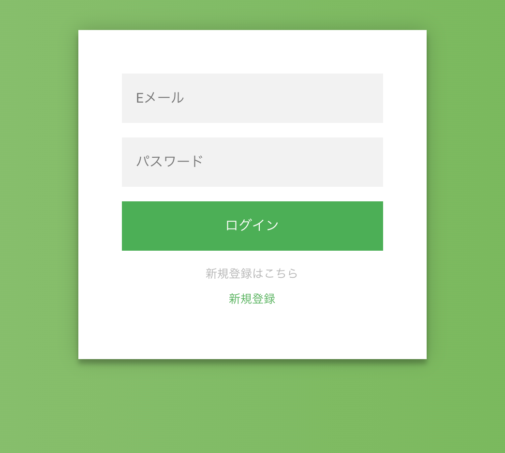
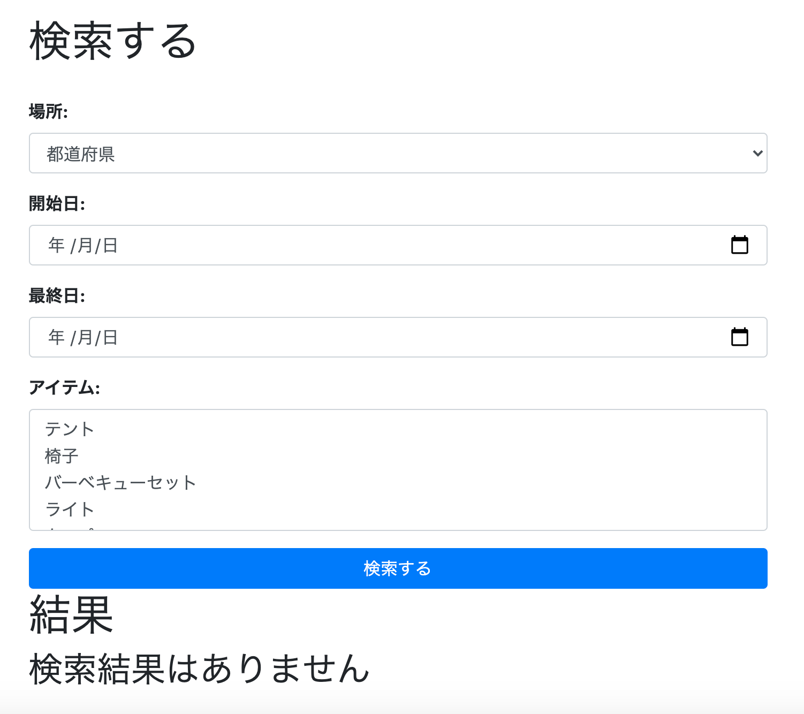
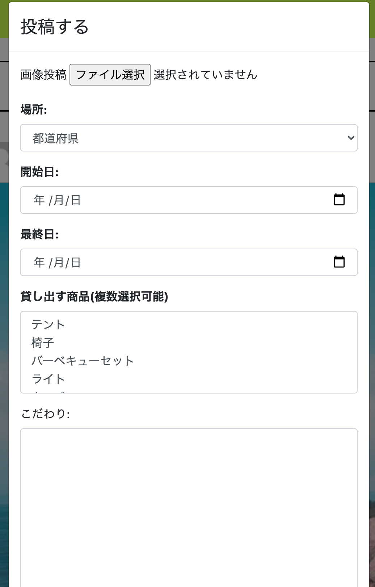

# Welife
## URL
アプリURL:https://welife-20011120.herokuapp.com/
## 概要
Welifeは、キャンプ用品をシェアリングすることができるCtoCサービスです。
お金がない学生でもWelifeを使うことでキャンプを手軽にできるようになるし、
貸している側は年に数回しか使わなかったキャンプ用品が
お金を生み出すようになります。
## Welifeの機能
### リクエスト機能（投稿に対して借りたいと意思表明する機能）

### ログイン、サインアップ機能

- ページネーション機能
### 検索機能

### 投稿機能

- レスポンシブ対応
### 投稿編集機能

### リクエスト確認機能

### 投稿一覧機能

##  技術一覧
- 使用言語
    - PHP,HTML,CSS,Javascript
- 使用フレームワーク
    - Laravel,Bootstrap
- 本番環境
    - heroku
- データベース
     - PostgreSQL
- 画像アップロード先
     - AWS S3使用
- デプロイ方法
    - Circle Ci/CD使用(自動テスト、自動デプロイ)
    - Cicle Ciでの使用ツール
        - Phing,phpunit,PHP_codeSniffer,PHPMD,PHPCPD,PHPLOC,PHPDocumentor
